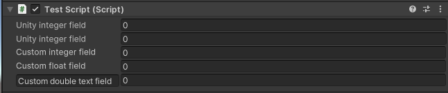
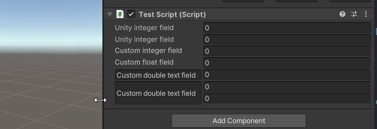

# Unity Scaling Custom Base field Example 

This repository contains the example and source used to create an unity base field. A blog post about how it was created and how it works can be found on [codinglike.lieke.lgbt](https://codinglike.lieke.lgbt/posts/unity-uitoolkit-base-field/).

## Problem
When creating your own custom fields in Unity UIToolkit they are to style them like Unity fields. Unity has styling to accomplish this using the base-field class. However how it works and how to implement it is undocumented and difficult to emulate. This becomes a problem primarily during scaling as the fields will look quite different and not line up. 


## Solution

This USS let's you scale fields the fields according to the unity standard. This also removes the space between fields. Letting you style your fields fast and easy. 

## Example
Possible fields that can be made with the USS:



Scaling the base fields in action:



## What is it doing?

The USS was extracted by creating a IntegerField. Then going to the UI Toolkit Debugger and for each class copying the Unity USS. The classes it was copied from can be found in the USS. The total process and how to use it can be found in the blog post on [codinglike.lieke.lgbt](https://codinglike.lieke.lgbt/posts/unity-uitoolkit-base-field/).

## How to use it?

- Copy the Uss from `Assets/Editor/custom-base-field.uss` into your project. 
- Add the classes `custom-unity-field-container`, `custom-unity-field-label` and `custom-unity-field-value` to the VisualElements. 

Example usage: 
````xml
<engine:VisualElement name="container-custom-label" class="custom-unity-field-container">
    <engine:Label name="integer-field-label" class="custom-unity-field-label" text="Custom integer field"></engine:Label>
    <editor:IntegerField name="integer-field-value" class="custom-unity-field-value"></editor:IntegerField>
</engine:VisualElement>
````
More examples can be found in `Assets/Editor/custom-base-field-layout`

## Problems with special custom fields 
When creating special custom fields they sometimes have problems with the margins not being set to 0px. You can find more about this in the blog post. 

